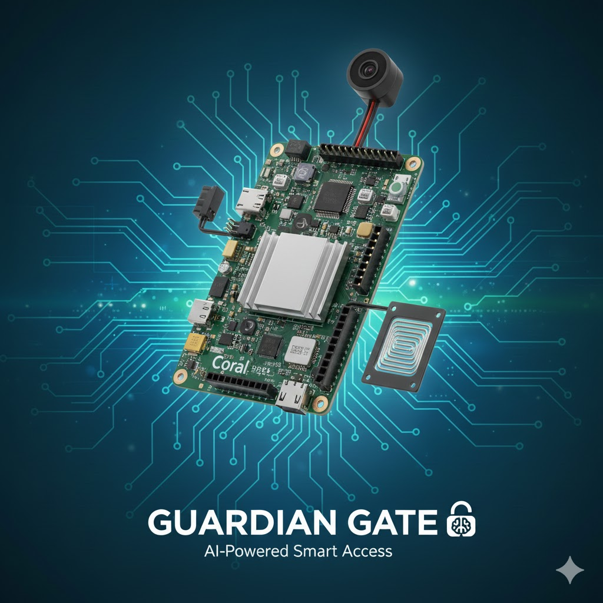
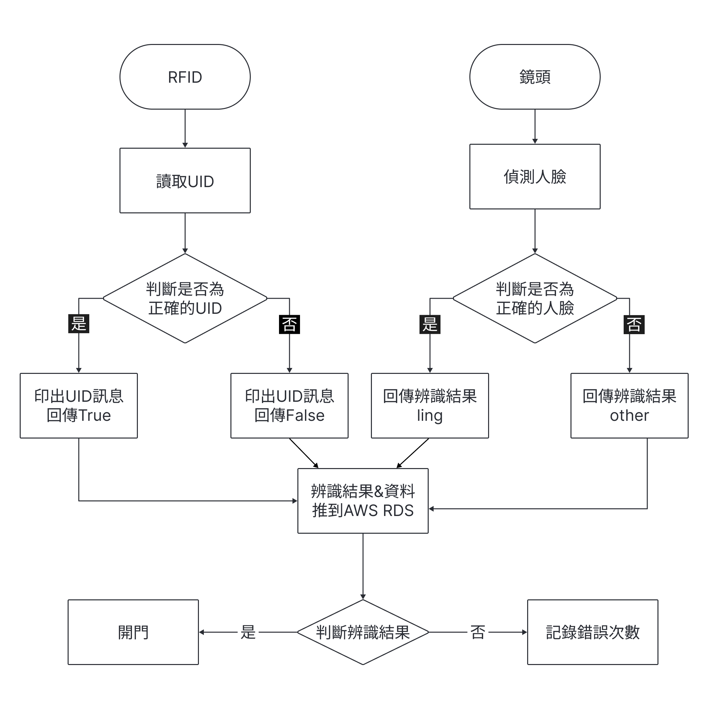
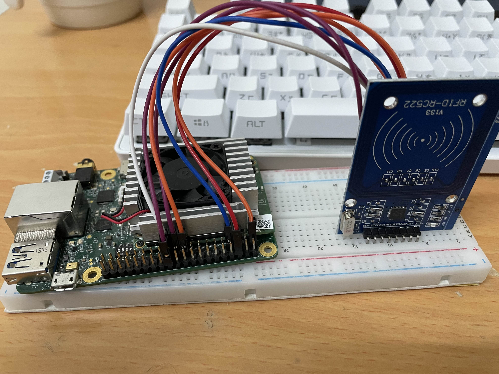

# Edge_ACS - AIoT 智慧整合系統



## 📖 專案簡介 (Introduction)
這是一個結合 **Edge AI (Coral)** 的智慧系統，旨在解決提供一個極致彈性且以使用者為中心的解決方案，允許使用者選擇他們當下最方便的任一方式通過驗證。並且可以在資料庫中查看登入及陌生人的紀錄。

### 🚀 核心功能
- **Edge AI 辨識**：使用 Coral Dev Board 執行透過遷移式訓練的 MobileNetV2 模型，偵測人臉；以及透過組員自行修改的 MCFR 套件讀取 RFID。
- **雲端戰情室**：透過 {MQTT/AWS} 傳輸數據，並在網頁上視覺化呈現。

---

## 🛠️ 系統架構 (System Architecture)


### 技術堆疊 (Tech Stack)
- **Edge Device**: Coral Dev Board (Google Edge TPU)
- **Connectivity**: MQTT Protocol / AWS IoT Core

---

## 🔌 硬體配置 (Hardware Setup)


### 接線說明
1. **Coral** USB -> **Camera**
2. **Coral** Pin 24 -> SDA、
             Pin 23 -> SCK、
             Pin 19 -> MOSI、
             Pin 21 -> MISO、
             Pin 7 -> RST、
             Pin 6 -> GND、
             Pin 1 -> 3.3V 

  連接 RC-522

---

## 💻 安裝與執行 (Installation)

### 1. 啟動 Web Dashboard
```bash
cd Edge_ACS
pip install -r ../requirements.txt
python3 rfid.py
python3 face_recon.py